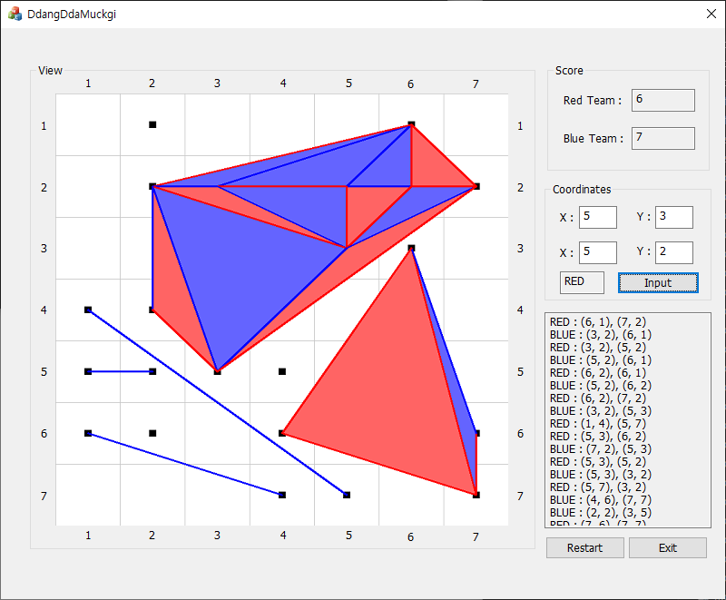

## AI Board Game

### 알고리즘 설명
 - Min-Max Algorithm을 이용한 인공지능 보드게임 프로젝트
 - 최대 두 수 까지 탐색하여 최적의 수를 이행함
 - 프루닝 및 몬테칼로 방식을 통한 효율적 탐색

### 게임 규칙
 - 턴을 돌며 점과 점 사이를 이음
  - 선을 교차하여 그릴 수 없음
 - 삼각형을 만들면 스코어 획득
  - 작은 삼각형만 점수에 포함됨
 - 삼각형을 많이 만들면 승리

### 프로그램 사용 방법
 - 마우스 왼쪽 클릭으로 직선의 시작점 설정
 - 마우스 오른 클릭으로 직선의 끝점 설정
 - input 버튼을 눌러 선을 그음
 - 마우스 휠 버튼을 누르면 AI가 수를 둠
